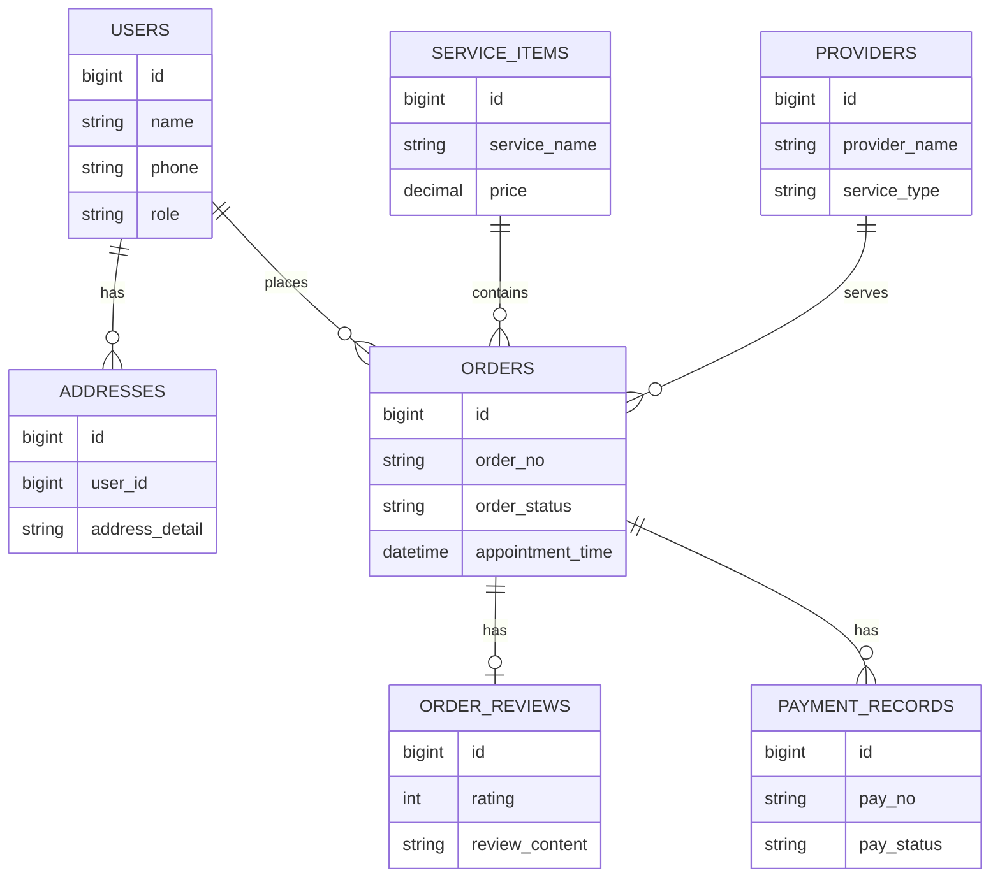

```mermaid
erDiagram
    USERS ||--o{ ADDRESSES : has
    USERS ||--o{ ORDERS : places
    SERVICE_ITEMS ||--o{ ORDERS : contains
    PROVIDERS ||--o{ ORDERS : serves
    ORDERS ||--o| ORDER_REVIEWS : has
    ORDERS ||--o{ PAYMENT_RECORDS : has

    USERS {
      bigint id
      string name
      string phone
      string role
    }
    ADDRESSES {
      bigint id
      bigint user_id
      string address_detail
    }
    SERVICE_ITEMS {
      bigint id
      string service_name
      decimal price
    }
    PROVIDERS {
      bigint id
      string provider_name
      string service_type
    }
    ORDERS {
      bigint id
      string order_no
      string order_status
      datetime appointment_time
    }
    ORDER_REVIEWS {
      bigint id
      int rating
      string review_content
    }
    PAYMENT_RECORDS {
      bigint id
      string pay_no
      string pay_status
    }
```
