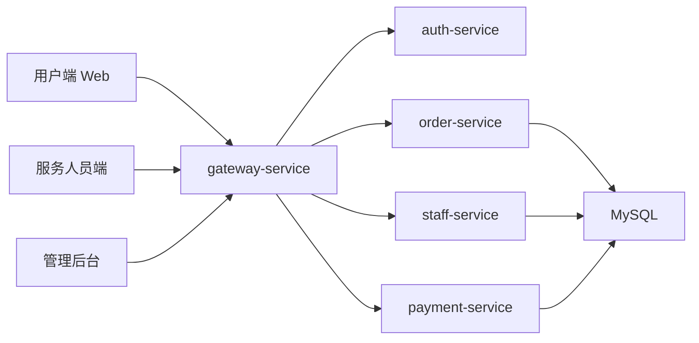

```mermaid
flowchart LR
    U["用户端 Web"] --> G["gateway-service"]
    P["服务人员端"] --> G
    A["管理后台"] --> G
    G --> AU["auth-service"]
    G --> O["order-service"]
    G --> S["staff-service"]
    G --> PAY["payment-service"]
    O --> DB["MySQL"]
    S --> DB
    PAY --> DB
```
